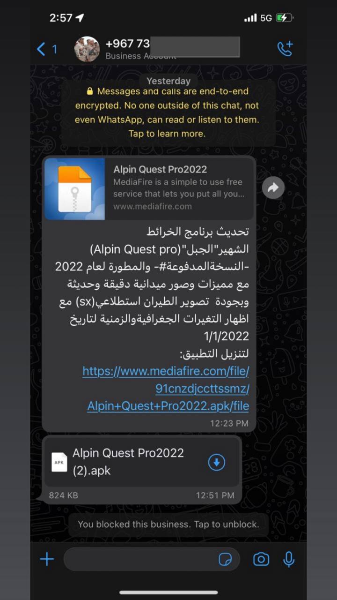
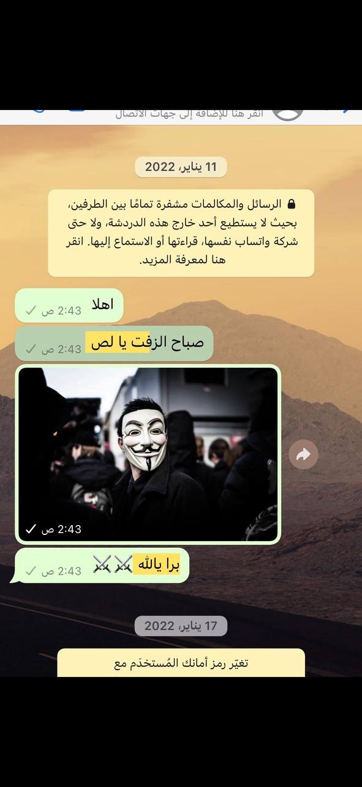
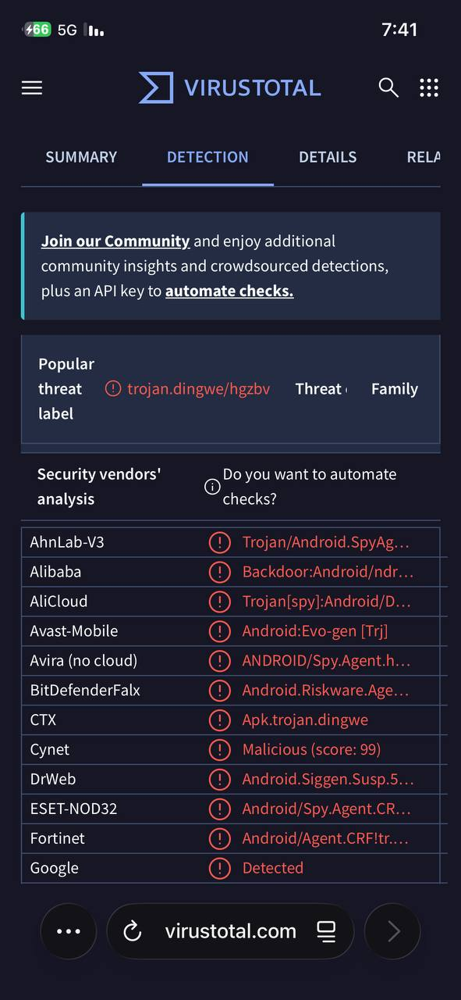
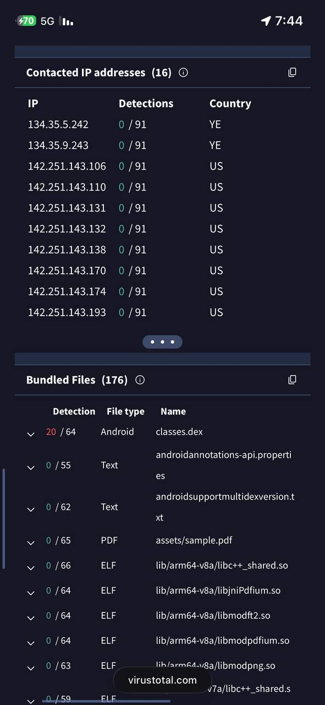

# GuardZoo Early Evidence

Field evidence and indicators for the GuardZoo Android surveillanceware campaign (Houthi-aligned, Yemen), documented in January 2022 and cross-referenced with the indicators later published by Lookout in July 2024.

For defensive and research purposes only.

## Background

GuardZoo is Android surveillanceware that targets military personnel in the Middle East. It was publicly disclosed by Lookout on 9 July 2024 and attributed to a Yemeni, Houthi-aligned threat actor. The campaign has been active since around October 2019. The malware is based on the leaked Dendroid RAT and uses a custom ASP.NET command-and-control backend served on IIS. It is delivered through WhatsApp, WhatsApp Business, Telegram, and direct browser download, mainly using military and mapping-app lures, and its primary collection objective is GPS and map files (KMZ, WPT, RTE, TRK).

## Field observation (January 2022)

In January 2022, while tracking threats aimed at individuals in the region, I encountered an Android malware operation spreading over messaging apps. What stood out was the lure: a fake topographic mapping and navigation app, framed with military reconnaissance language, delivered as an APK from outside any official app store. That delivery pattern does not match a legitimate app update, so I tracked the sending account and the file and preserved the messages and distribution details. This predated the earliest discovery date referenced in public reporting (October 2022) by roughly nine months, and the public naming of the campaign by Lookout in July 2024 by two and a half years.

### Delivery sample (January 2022)

In January 2022, a trojanized lure was delivered from a Yemeni number over both WhatsApp Business and Telegram, disguised as a paid 2022 update of the AlpineQuest topographic mapping app ("Alpin Quest Pro2022"), hosted as an APK on MediaFire. This matches the GuardZoo pattern precisely: a fake GPS/mapping app is the ideal lure to reach victims who already hold the KMZ/WPT/RTE/TRK files the actor seeks.

Note: the original APK is no longer retained. The published samples and the live confirmation below cover the family and the infrastructure.

### Direct response

A targeted individual, kept anonymous here for their protection, reached out to me for help. I reviewed the messages and the malicious APK, confirmed the delivery was hostile, and took technical and reporting measures against the operator. As a result, the attacker's accounts were removed from both WhatsApp and Telegram, and the legitimate accounts were successfully restored to their owner. The priority throughout was protecting the targeted person and documenting the activity without exposing them.

The screenshot above captures the direct confrontation with the operator on **11 January 2022**. The "security code changed" notice dated **17 January 2022** that follows is consistent with the legitimate account being restored to its rightful owner on a new device, in line with the outcome described above. These dated screenshots document the field interaction; they are not in themselves a technical attribution.

## Analysis and confirmation

The published indicators were checked independently on VirusTotal, and the sample's own behavior confirms them.

Detection: the sample is flagged as Android spyware by a broad majority of engines, with a popular threat label of trojan.dingwe, another name for the Dendroid lineage that GuardZoo is built on.

Behavior: the sample contacts somrasdc.ddns.net (the published backup C2) using requests that carry UID (victim identifier) and Password (authentication) parameters, exactly as described by Lookout. It also contacts YemenNet IP addresses 134.35.5.242 and 134.35.9.243, and bundles assets/sample.pdf alongside a flagged classes.dex, indicating a PDF-document lure for this particular sample.

Together this shows that the published indicators and the C2 protocol are real and live, and places the 2022 field observation inside a verified campaign. This is corroborating evidence; it is not, on its own, a forensic link to a specific named individual.

## Indicators

Machine-readable indicators are in this repository:

- indicators.txt: C2 domains, resolved YemenNet IPs, TLS certificate fingerprint, C2 request structure, and the delivery artifact
- sha256.txt: published sample hashes

## Detection

Detection rules built on publicly documented GuardZoo characteristics are in the `detection/` folder:

- guardzoo.yar: YARA rule for the malware family (class names, C2 strings, DEX update URI)
- guardzoo_c2_dns.yml: Sigma rule for DNS queries to the C2 domains
- guardzoo_c2_proxy.yml: Sigma rule for HTTP requests to the C2 hosts and the DEX update URI

These are heuristic and based on public reporting; tune field names and thresholds to your environment before production use.

The attacker phone number is partially redacted; the country code is retained for attribution.

## Not to be confused with a separate 2025 campaign

A different 2025 campaign reported by Doctor Web also used a trojanized AlpineQuest app, but it targeted Russian military personnel, was distributed via Telegram, and is not attributed to the Houthis. The evidence here concerns GuardZoo, not that campaign.

## Machine-readable exports

- [stix/guardzoo_iocs.json](stix/guardzoo_iocs.json): STIX 2.1 bundle (identity, malware, intrusion-set, 31 indicators, relationships). Regenerate with `python3 generate_exports.py`.
- [misp/guardzoo_event.json](misp/guardzoo_event.json): MISP event (32 attributes, TLP:CLEAR) ready for import.

## Timeline and ATT&CK mapping

- [timeline.md](timeline.md): campaign chronology combining field evidence (2022) with public reporting.
- [attack-mapping.md](attack-mapping.md): MITRE ATT&CK (Mobile) technique mapping with evidence sources.

## Sources

- Lookout Threat Lab, GuardZoo report, 9 July 2024: https://www.lookout.com/threat-intelligence/article/guardzoo-houthi-android-surveillanceware
- Sample behavior independently confirmed on VirusTotal.

## Credit

Field evidence and analysis: Mijlad Alsubaie — مجلاد بن مشاري السبيعي (Screem500)

- GitHub: [@screem500](https://github.com/screem500)
- X (Twitter): [@Al7lhh223](https://x.com/Al7lhh223)
## ملخص بالعربية

توثيق لأدلة ميدانية على حملة GuardZoo، وهي برمجية تجسس أندرويد محسوبة على الحوثيين تستهدف عسكريين في المنطقة. رُصدت الأدلة في 2022، أي قبل الكشف العلني الذي نشرته Lookout في يوليو 2024 بسنتين. تشمل الأدلة توصيل نسخة مفخخة من تطبيق الخرائط AlpineQuest عبر واتساب بزنس وتيليجرام من رقم يمني. تواصل معي الشخص المستهدف (يبقى مجهول لحمايته) طلباً للمساعدة، واتُّخذت إجراءات تقنية أدّت إلى إزالة حسابات المهاجم من واتساب وتيليجرام، وإعادة الحسابات لأصحابها الشرعيين بنجاح. وتأكدت المؤشرات حيّاً عبر VirusTotal، حيث تتصل العيّنة بنطاق الـ C2 المنشور somrasdc.ddns.net بمعاملات UID وPassword، وبعناوين YemenNet. هذا التوثيق دفاعي وبحثي، وأدلة تتقاطع مع مؤشرات منشورة ومؤكّدة، وليست إسناداً قاطعاً لشخص بعينه.

